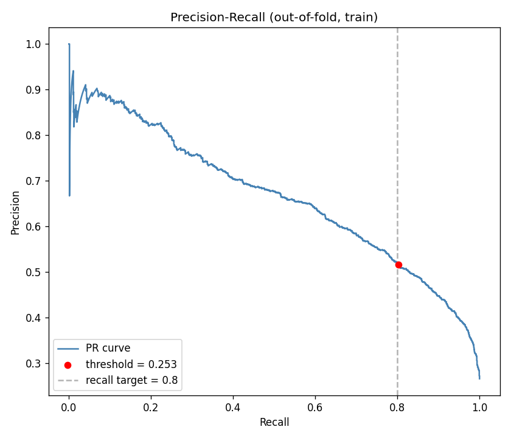
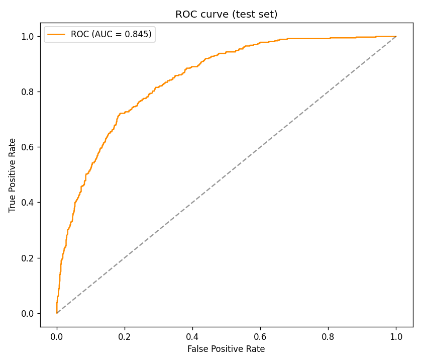
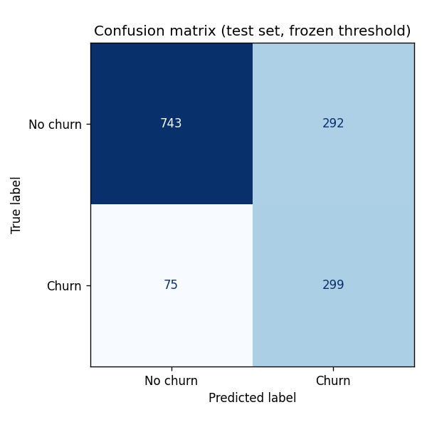

# Results — Telco Churn Model

## Why not accuracy
The classes are imbalanced (~27% churn). A model that
always predicts "no churn" already scores **73.5% accuracy** while
catching zero churners. Accuracy is therefore meaningless here; we optimise for
**recall on the churn class** (a missed churner costs ~5x a false alarm) and
report ROC-AUC / average precision for ranking quality.

## Cross-validation comparison (5-fold stratified, train only)
Mean +/- std on the churn (positive) class.

| Model | recall | precision | f1 | roc_auc |
| --- | --- | --- | --- | --- |
| Dummy (most_frequent) | 0.000 +/- 0.000 | 0.000 +/- 0.000 | 0.000 +/- 0.000 | 0.500 +/- 0.000 |
| Dummy (stratified) | 0.278 +/- 0.025 | 0.275 +/- 0.025 | 0.276 +/- 0.025 | 0.507 +/- 0.017 |
| Logistic Regression | 0.797 +/- 0.035 | 0.518 +/- 0.016 | 0.628 +/- 0.021 | 0.846 +/- 0.011 |
| Random Forest | 0.464 +/- 0.031 | 0.640 +/- 0.033 | 0.538 +/- 0.029 | 0.827 +/- 0.011 |
| Gradient Boosting | 0.522 +/- 0.025 | 0.662 +/- 0.035 | 0.583 +/- 0.026 | 0.847 +/- 0.011 |

Both DummyClassifier baselines are beaten by every real model on recall and
ROC-AUC, which justifies discarding accuracy as the headline metric.

## Best model & tuning
* Selected by CV ROC-AUC: **Gradient Boosting**
* GridSearchCV (scoring = average precision) best params: `{'model__learning_rate': 0.05, 'model__max_depth': 2, 'model__n_estimators': 300}`
* Best CV average precision: 0.668

## Threshold
Chosen on out-of-fold **training** probabilities (never the test set) as the
highest-precision threshold with recall >= 0.80.
**Frozen threshold = 0.253.**

## Final test-set performance (scored once)
| Metric | Value | Target |
|--------|------:|:------:|
| Recall (churn)    | 0.799 | >= 0.75 |
| Precision (churn) | 0.506 | >= 0.45 |
| ROC-AUC           | 0.845 | — |
| Average precision | 0.662 | — |

Confusion matrix:

|  | Pred: No churn | Pred: Churn |
| --- | --- | --- |
| True: No churn | 743 | 292 |
| True: Churn | 75 | 299 |

## Business translation
At the frozen threshold the model flags about **419 customers per
1000**, of whom roughly **212 are real churners**. For a 1000-customer
weekly batch that is ~419 retention calls to catch ~212 of
the at-risk customers — the marketing team trades a manageable call volume for
catching the large majority of churners before they cancel.

